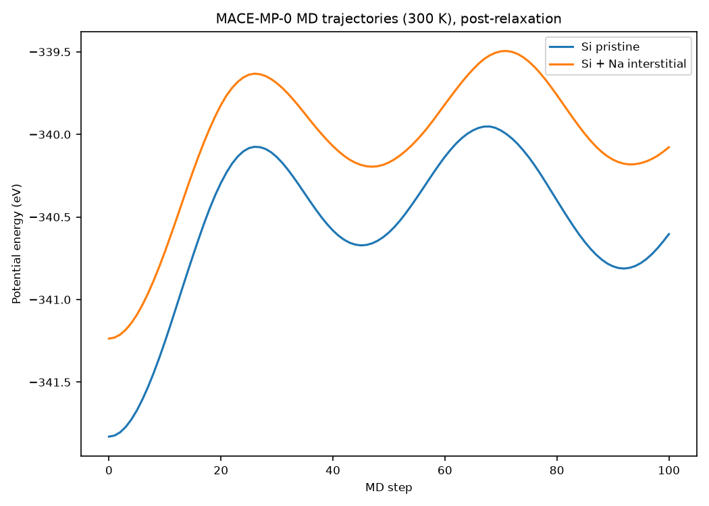
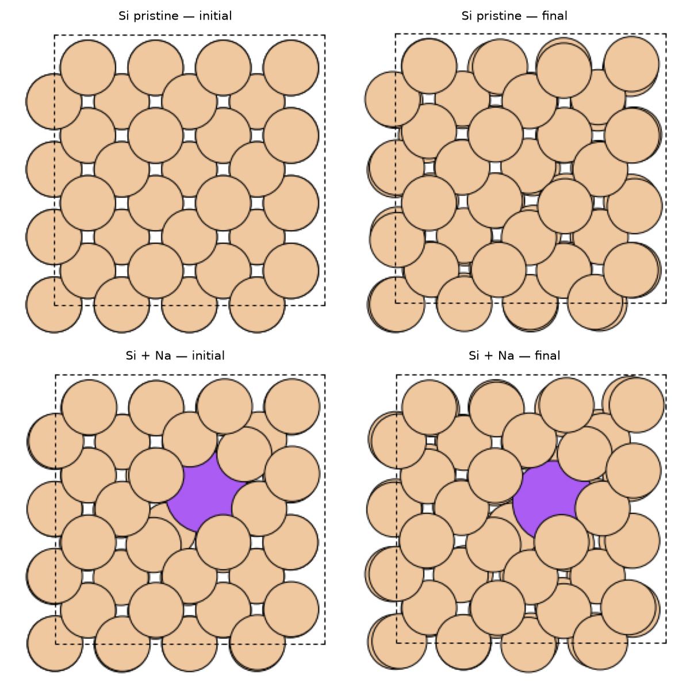

# First steps with MACE — Machine-Learning Interatomic Potentials

Introductory, self-directed project exploring machine-learning interatomic
potentials (MLIPs) for molecular dynamics, using the pre-trained
**MACE-MP-0** foundation potential (Batatia et al., trained on the
Materials Project MPTrj dataset).

This is a first hands-on step toward using MLIPs for large-scale MD,
building on prior experience with DFT (GPAW, CASTEP) and classical MD
(LAMMPS).

## What this project does

1. Builds a small silicon supercell (bulk diamond structure, ~64 atoms)
2. Builds a second structure with one interstitial Na atom, as a minimal
   analogy for an ion confined in a solid matrix
3. Loads the pre-trained MACE-MP-0 potential (no training performed here —
   inference/MD only) via the ASE calculator interface
4. Relaxes both structures (BFGS) to remove unphysical initial contacts
5. Runs a short Langevin MD simulation (300 K, 100 steps) on each system
6. Compares the potential energy trajectories and visualizes the structures
   before/after MD

## Results

### Energy trajectories



After geometry relaxation, the Si+Na system shows an energy consistently
shifted by ~0.2 eV above the pristine Si system throughout the MD run,
consistent with an energy cost associated with the local lattice distortion
induced by the interstitial ion.

### Structures before/after MD



A visible local rearrangement of Si atoms around the Na interstitial can be
observed between the initial and final configurations, while the pristine
system remains largely unchanged.

## What this is *not*

This project uses an existing, pre-trained foundation potential
(MACE-MP-0) for inference and short MD runs — **no potential was trained
or fine-tuned** here. It is a first step toward the full DFT → dataset →
MLIP training → large-scale MD pipeline, not an implementation of it.

## Tools

MACE, ASE, Python, NumPy, Matplotlib

## Next steps

- Generate a small custom DFT dataset (e.g. with GPAW) for a system of
  interest
- Fine-tune MACE-MP-0 on this dataset (`mace_run_train --foundation_model`)
- Validate the fine-tuned potential against DFT reference values
- Explore enhanced-sampling methods (metadynamics via PLUMED) for
  free-energy landscapes
- Extend to more realistic ion/solid or ion/water interface systems

## How to run

```bash
pip install -r requirements.txt
python run_mace_md_comparative.py
```
